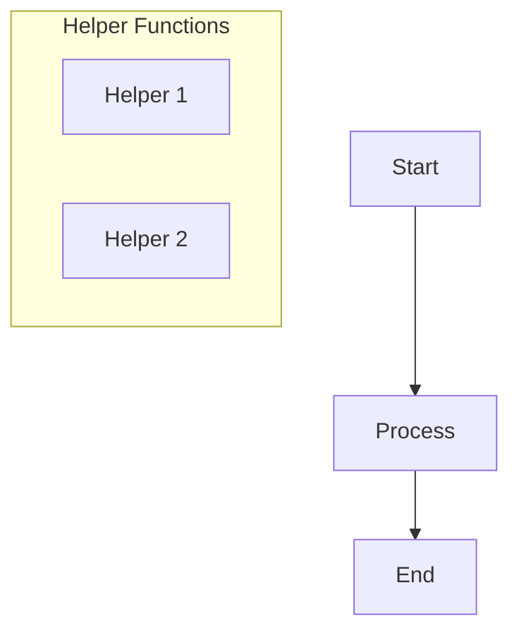
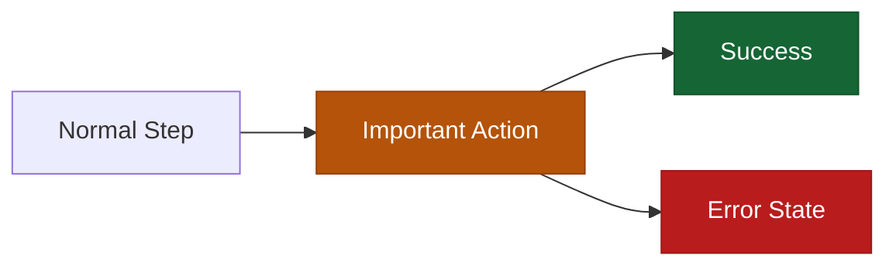
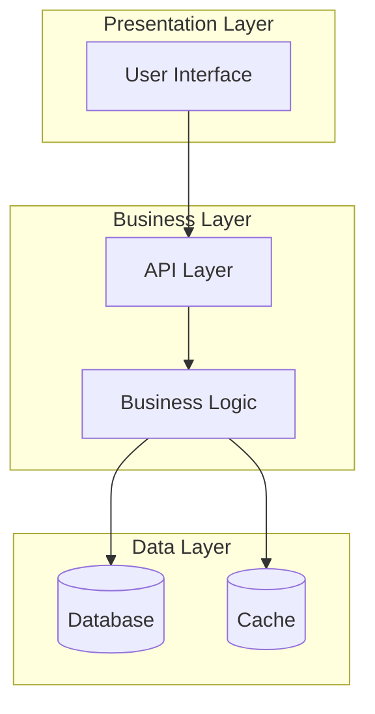
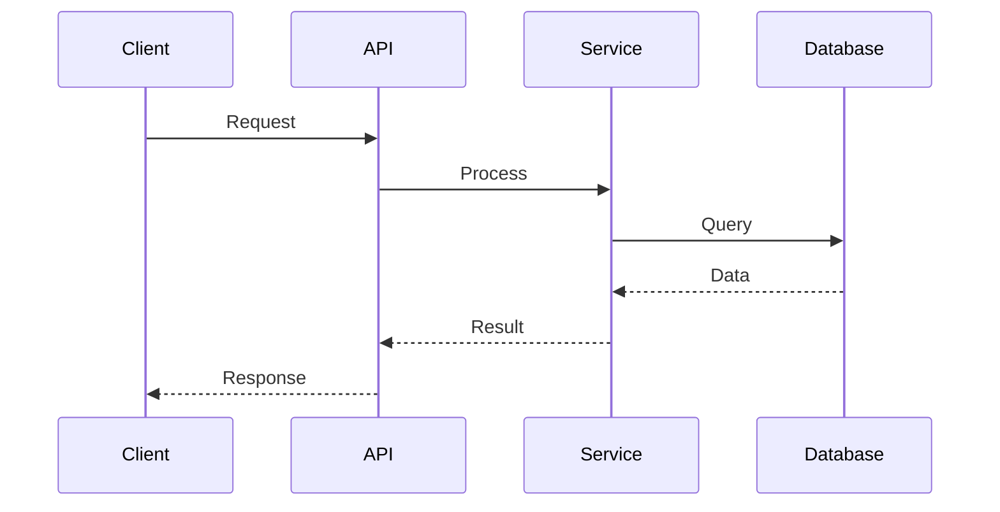

# Diagram Generation

Generate clear, professional diagrams using Mermaid syntax for visualizing code architecture, system flows, processes, and relationships. All diagrams render in VS Code with Mermaid extensions and natively in GitHub markdown.

## Workflow

1. **Understand the request**:
   - What needs to be visualized
   - Which diagram type is most appropriate
   - Level of detail required
   - Audience and purpose

2. **Analyze context** (if code-related):
   - Read relevant files if specific files mentioned
   - Identify key components and relationships
   - Determine important flows or structures
   - Note dependencies and interactions

3. **Select diagram type**:
   - **Flowchart**: Control flow, decision logic, process flows
   - **Sequence**: API/function call flows, time-based interactions
   - **Component/Architecture**: System structure, module relationships
   - **Class**: OOP relationships, inheritance hierarchies
   - **State**: State machines, workflow states
   - **ER Diagram**: Database schemas, entity relationships
   - **Git Graph**: Branch strategies, version control flows
   - **Gantt**: Project timelines, schedules
   - See [diagram-types.md](diagram-types.md) for complete syntax reference for each type

4. **Generate Mermaid syntax**:
   - **Always use `flowchart` keyword, NEVER `graph`** (better compatibility)
   - Use **plain descriptive text** in labels, not code syntax
   - **Avoid special characters**: `{}`, `===`, `...`, `()` in labels
   - Keep diagrams readable (not too crowded)
   - Use meaningful, descriptive labels
   - Add styling/colors where helpful
   - Use subgraphs carefully (see constraints below)
   - Use appropriate arrow types and relationships
   - Refer to [diagram-types.md](diagram-types.md) for specific syntax details if needed

5. **Provide context**:
   - Brief description of what the diagram shows
   - Explain key elements or sections
   - Note any assumptions or simplifications
   - Suggest how to read/interpret the diagram

6. **Validate syntax**:
   - **Critical**: Review diagram for syntax issues BEFORE saving
   - Check for special characters in labels (replace with descriptive text)
   - Ensure using `flowchart` not `graph`
   - Verify subgraphs don't mix with main flow nodes
   - Confirm no duplicate node IDs in class definitions
   - Mentally render the diagram to ensure it makes sense

7. **Save to file**:
   - Always save diagrams to markdown files for rendering
   - Use descriptive filenames based on diagram purpose
   - Default location: project root (or `docs/diagrams/` if docs folder exists)
   - Filename format: `[feature-name]-[diagram-type].md` (e.g., `auth-flow-sequence.md`, `database-schema-er.md`)
   - After saving, remind user: "Open the file and press `Cmd+Shift+V` (Mac) or `Ctrl+Shift+V` (Windows/Linux) to view the rendered diagram in VS Code preview"

## Diagram Type Selection Guide

### Flowchart (graph/flowchart)
**Use for:**
- Algorithm logic and decision trees
- Process flows and workflows
- System architecture (high-level)
- Component relationships and dependencies

**Best for:** Showing structure and flow

### Sequence Diagram
**Use for:**
- API request/response flows
- Function call sequences
- Actor interactions over time
- Message passing between components

**Best for:** Time-based interactions

### Class Diagram
**Use for:**
- Object-oriented design
- Class hierarchies and relationships
- Interface definitions
- Inheritance and composition

**Best for:** OOP structure

### State Diagram
**Use for:**
- State machines
- Workflow states and transitions
- Application lifecycle
- User journey states

**Best for:** State transitions

### ER Diagram
**Use for:**
- Database schemas
- Entity relationships
- Data models
- Table structures

**Best for:** Data modeling

**Note:** For complete examples of each diagram type in real-world scenarios, see [examples.md](examples.md).

## Output Format

Always provide diagrams in this structure:

```markdown
# [Diagram Title]

## Description
[1-2 sentences explaining what this diagram shows and its purpose]

## Diagram

```mermaid
[Mermaid syntax here]
```
\`\`\`

## Key Elements
- **[Element/Section 1]**: [What it represents]
- **[Element/Section 2]**: [What it represents]
- **[Important relationship]**: [Why it matters]

## Notes
[Optional: Important details, assumptions, limitations, or suggestions]
```

**Note:** See [examples.md](examples.md) for complete examples following this format.

## Mermaid Syntax Constraints

**Critical rules to prevent parsing errors:**

### Always Use `flowchart` Not `graph`
```
✅ flowchart TD
❌ graph TD
```
The `flowchart` keyword has better parser compatibility and more features.

### Avoid Special Characters in Labels
**Never use:**
- Curly braces: `{}`, `{...obj}`
- Operators: `===`, `!==`, `>=`
- Spread syntax: `...`
- Template literals: `${var}`
- Parentheses in complex contexts

**Instead use descriptive text:**
```
❌ {item, depth}
✅ with item and depth

❌ parent === null
✅ parent equals null

❌ {...item}
✅ spread item properties
```

### Subgraph Usage Rules
**DO:**
- Use subgraphs to group independent, related nodes
- Add space padding to labels: `" Label Text "`
- Use hyphens instead of parentheses: `" Input - Unordered "`
- Keep subgraphs self-contained

**DON'T:**
- Put nodes in subgraphs if they're part of the main flow connections
- Create arrows between nodes in different subgraphs
- Mix subgraph nodes with main flow nodes
- Use parentheses in subgraph labels

**Example - Correct subgraph usage:**


**Example - Incorrect (will cause errors):**
```mermaid
flowchart TD
    Start --> Filter
    Filter --> End

    subgraph "Processing"
        Filter  ❌ Already in main flow!
    end
```

### Other Syntax Rules
- Each node ID should appear **exactly once** in class definitions
- Don't create circular references combined with subgraph grouping
- Keep complex flows simple - split into multiple diagrams if needed
- Test mentally before generating

## Best Practices

### Keep It Clear
- Don't overcrowd diagrams (max 10-15 nodes for clarity)
- Use descriptive labels, not abbreviations
- Group related items with subgraphs
- Add colors/styling to highlight important elements

### Make It Readable
- Flow top-to-bottom or left-to-right consistently
- Align related nodes
- Use whitespace effectively
- Label all arrows/relationships

### Be Accurate
- Match the actual code/system structure
- Use correct relationship types (inheritance vs composition)
- Verify arrow directions match data/control flow
- Include all critical components

### Add Value
- Focus on what's important, not every detail
- Highlight key paths or relationships
- Use colors to show categories or importance
- Add notes for non-obvious elements

### Color and Styling

**Readability First:**
- Ensure sufficient contrast between background color and text
- Maintain at least 4.5:1 contrast ratio for accessibility
- Test colors against both dark and light VS Code themes
- Avoid neon/bright colors that overpower text

**Recommended Color Palettes:**

**Dark Mode (default for most users):**
```
Primary (info):    fill:#1e40af,stroke:#1e3a8a,color:#fff
Success:           fill:#166534,stroke:#14532d,color:#fff
Warning:           fill:#b45309,stroke:#92400e,color:#fff
Error/Critical:    fill:#b91c1c,stroke:#991b1b,color:#fff
Neutral:           fill:#374151,stroke:#1f2937,color:#fff
```

**Light Mode:**
```
Primary (info):    fill:#dbeafe,stroke:#3b82f6,color:#1e3a8a
Success:           fill:#d1fae5,stroke:#10b981,color:#065f46
Warning:           fill:#fef3c7,stroke:#f59e0b,color:#78350f
Error/Critical:    fill:#fee2e2,stroke:#ef4444,color:#991b1b
Neutral:           fill:#f3f4f6,stroke:#9ca3af,color:#1f2937
```

**Usage Example:**


**Color Usage Guidelines:**
- **Blue/Primary**: Main flow, standard operations
- **Green/Success**: Successful outcomes, completed states
- **Orange/Warning**: Important notices, conditional paths
- **Red/Error**: Error states, critical issues, failures
- **Gray/Neutral**: Supporting information, optional paths

**When to Skip Colors:**
- Simple diagrams (3-5 nodes) may not need coloring
- Use colors purposefully, not decoratively
- Default Mermaid colors work fine for straightforward diagrams

## Common Patterns

### Layered Architecture


### Request Flow


## File Naming and Location

### Default Location Strategy
1. **Check for docs directory**: If `docs/` or `documentation/` exists, use `docs/diagrams/`
2. **Otherwise**: Save to project root
3. **User-specified**: If user mentions a location, use that

### Filename Convention
Format: `[feature-name]-[type].md`

Examples:
- `authentication-flow-sequence.md`
- `microservices-architecture.md`
- `database-schema-er.md`
- `order-lifecycle-state.md`
- `ci-cd-pipeline.md`

Use lowercase with hyphens, descriptive and specific.

## Quality Checklist

**Diagram Design:**
- [ ] Diagram type matches the visualization need
- [ ] All key components/elements included
- [ ] Relationships and flows are accurate
- [ ] Labels are clear and descriptive (plain text, no code syntax)
- [ ] Diagram is not overcrowded (max 10-15 nodes)

**Syntax Validation:**
- [ ] Using `flowchart` keyword (NOT `graph`)
- [ ] No special characters in labels (`{}`, `===`, `...`, etc.)
- [ ] Subgraphs are independent (not mixed with main flow)
- [ ] No cross-subgraph connections between individual nodes
- [ ] No duplicate node IDs in class definitions
- [ ] Subgraph labels use spaces and hyphens, not parentheses

**Output Quality:**
- [ ] Includes description and key elements section
- [ ] Colors are readable (dark fills with white text for dark mode)
- [ ] Saved to appropriate file location
- [ ] Filename is descriptive and follows convention

**Pre-Delivery Validation:**
- [ ] Syntax reviewed for common errors
- [ ] Diagram mentally renders without issues
- [ ] User reminded to use Cmd+Shift+V to view rendered diagram

See [examples.md](examples.md) for complete diagram examples by type.
See [diagram-types.md](diagram-types.md) for Mermaid syntax reference.
