# Mermaid Diagram Types Reference

Quick reference for Mermaid syntax and diagram types.

---

## ⚠️ Critical Syntax Constraints

**Read this first to avoid parsing errors:**

### 1. Always Use `flowchart` Not `graph`
```
✅ CORRECT:   flowchart TD
❌ WRONG:     graph TD
```
**Why:** `flowchart` has better parser compatibility and more features.

### 2. Avoid Special Characters in Labels
**Never use in node labels:**
- Curly braces: `{}`, `{...obj}`, `{prop}`
- Operators: `===`, `!==`, `>=`, `<=`
- Spread syntax: `...`
- Template literals: `${var}`
- Complex parentheses combinations

**Use plain descriptive text instead:**
| ❌ Avoid | ✅ Use Instead |
|---------|---------------|
| `{item, depth}` | `with item and depth` |
| `parent === null` | `parent equals null` |
| `{...item}` | `spread item properties` |
| `arr.filter(x => x)` | `filter array items` |

### 3. Subgraph Rules
**DO:**
- ✅ Use subgraphs for grouping independent nodes
- ✅ Add spacing in labels: `" Title "`
- ✅ Use hyphens: `" Input - Unordered "`
- ✅ Keep subgraphs self-contained

**DON'T:**
- ❌ Put nodes in subgraphs if they're in main flow
- ❌ Connect nodes across different subgraphs
- ❌ Use parentheses in subgraph labels
- ❌ Duplicate node IDs

### 4. Testing Requirement
**All diagrams MUST be mentally validated before delivery:**
- Check for special characters
- Verify `flowchart` usage
- Ensure subgraphs are independent
- Confirm no duplicate IDs

---

## Quick Reference Table

| Diagram Type | Keyword | Best For | Complexity |
|--------------|---------|----------|------------|
| Flowchart | `flowchart` | Process flows, architecture | ⭐⭐ |
| Sequence | `sequenceDiagram` | Time-based interactions | ⭐⭐⭐ |
| Class | `classDiagram` | OOP structure | ⭐⭐⭐ |
| State | `stateDiagram-v2` | State machines | ⭐⭐ |
| ER | `erDiagram` | Database schemas | ⭐⭐ |
| Gantt | `gantt` | Project timelines | ⭐⭐ |
| Git Graph | `gitGraph` | Version control | ⭐ |
| Pie | `pie` | Data distribution | ⭐ |
| Journey | `journey` | User experience | ⭐⭐ |

---

## 1. Flowchart / Graph

**Keywords:** `flowchart TD` or `graph TD`
**Direction:** TD (top-down), LR (left-right), BT (bottom-top), RL (right-left)

### Node Shapes

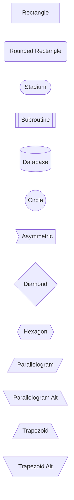

### Arrow Types

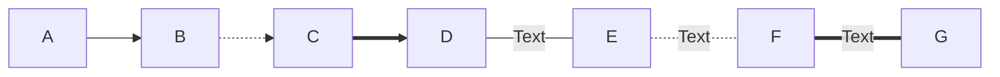

- `-->` Solid arrow
- `-.->` Dotted arrow
- `==>` Thick arrow
- `---|Text|` Arrow with text
- `-.-|Text|` Dotted with text
- `===|Text|` Thick with text

### Subgraphs (Grouping)

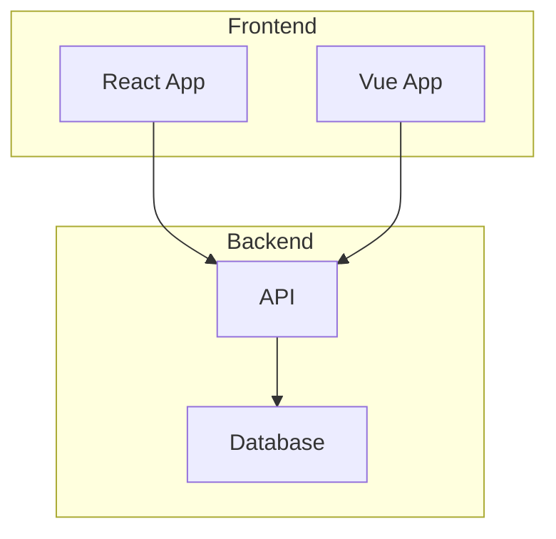

### Styling

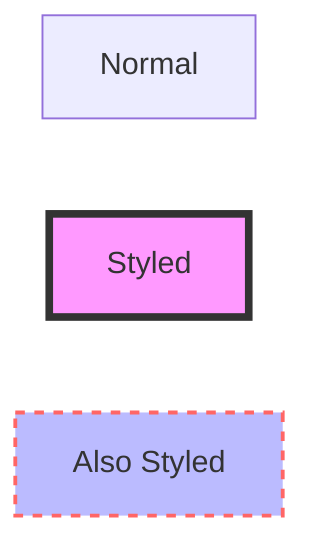

**Style Properties:**
- `fill` - Background color
- `stroke` - Border color
- `stroke-width` - Border thickness
- `stroke-dasharray` - Dashed border
- `color` - Text color

### Classes (Reusable Styles)

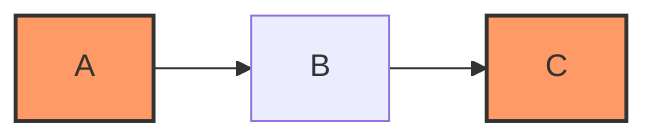

### Recommended Color Palettes

**Dark Mode (Most Common):**
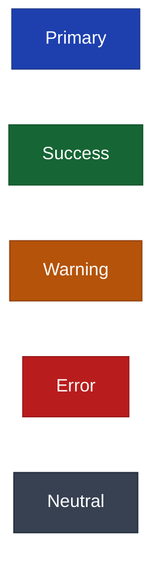

**Light Mode:**
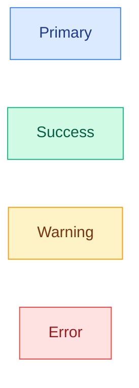

**Color Selection Tips:**
- Use dark fills with white text (`color:#fff`) for dark mode
- Use light fills with dark text for light mode
- Maintain 4.5:1 contrast ratio for readability
- Avoid neon/bright colors (yellow, cyan, magenta) that overpower text
- Use colors purposefully: green=success, red=error, orange=warning, blue=info

---

## 2. Sequence Diagram

**Keyword:** `sequenceDiagram`

### Basic Syntax

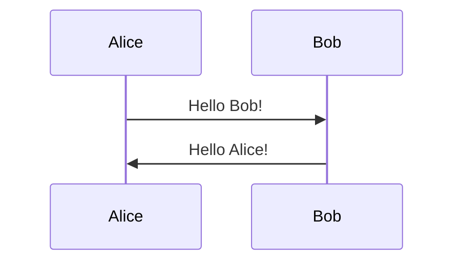

### Arrow Types

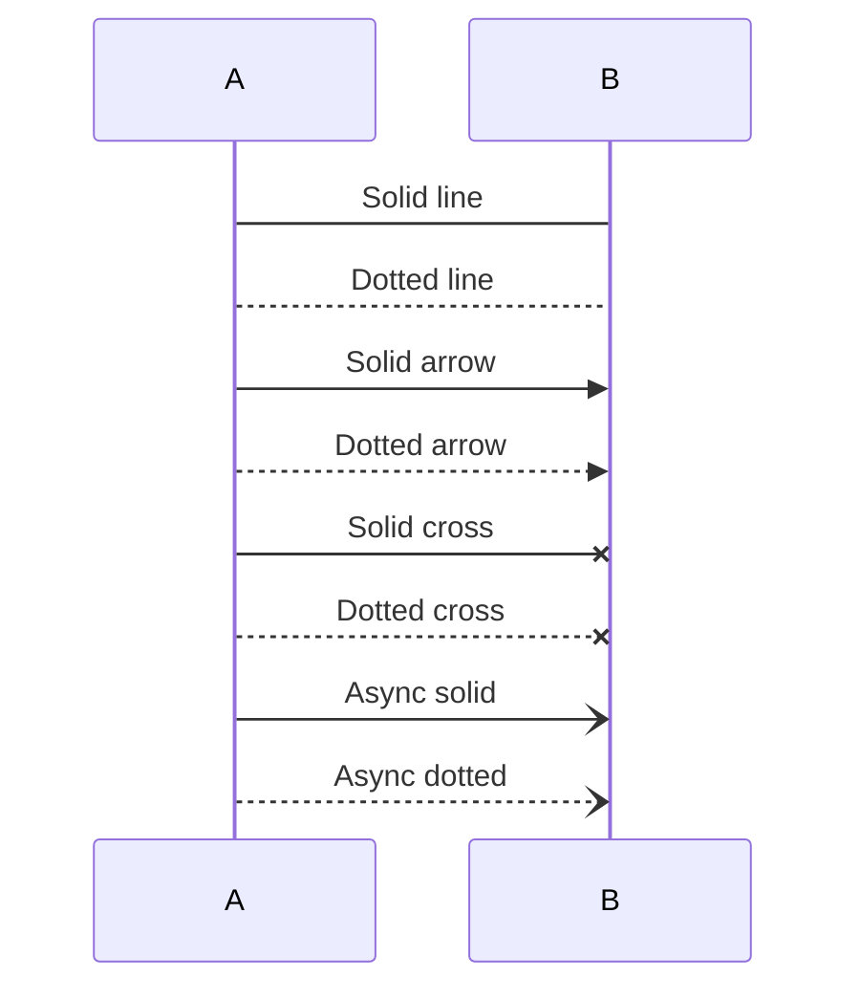

- `->` Solid line without arrow
- `-->` Dotted line without arrow
- `->>` Solid line with arrow
- `-->>` Dotted line with arrow
- `-x` Solid line with cross (represents destruction)
- `--x` Dotted line with cross
- `-)` Async message (solid)
- `--)` Async message (dotted)

### Activation Boxes


**Shorthand:**
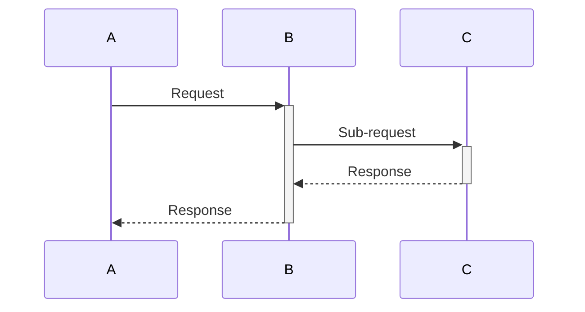

### Alt/Else/Opt/Loop

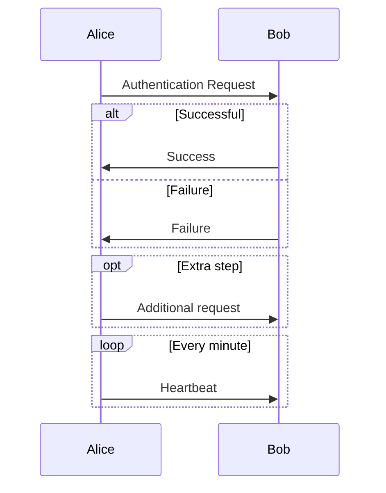

### Notes

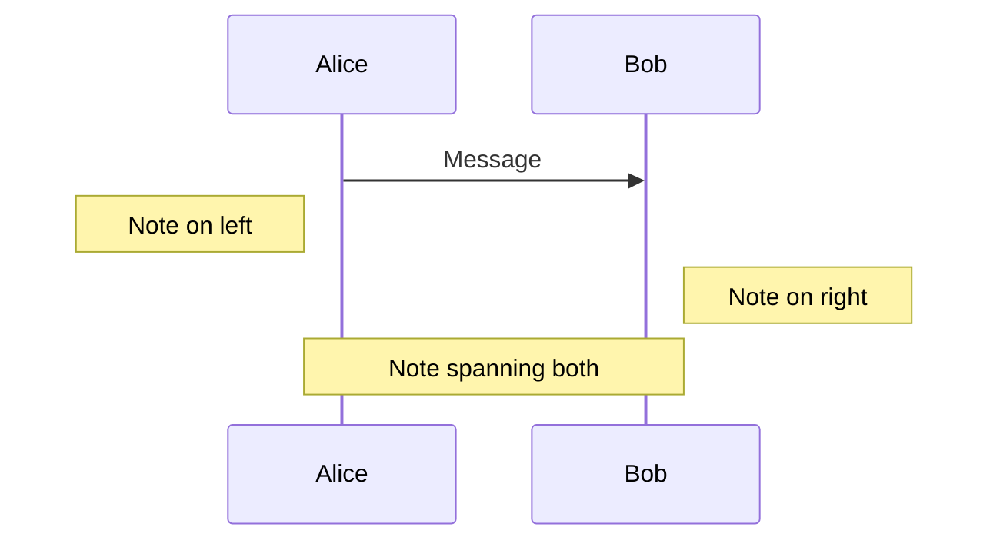

### Background Colors

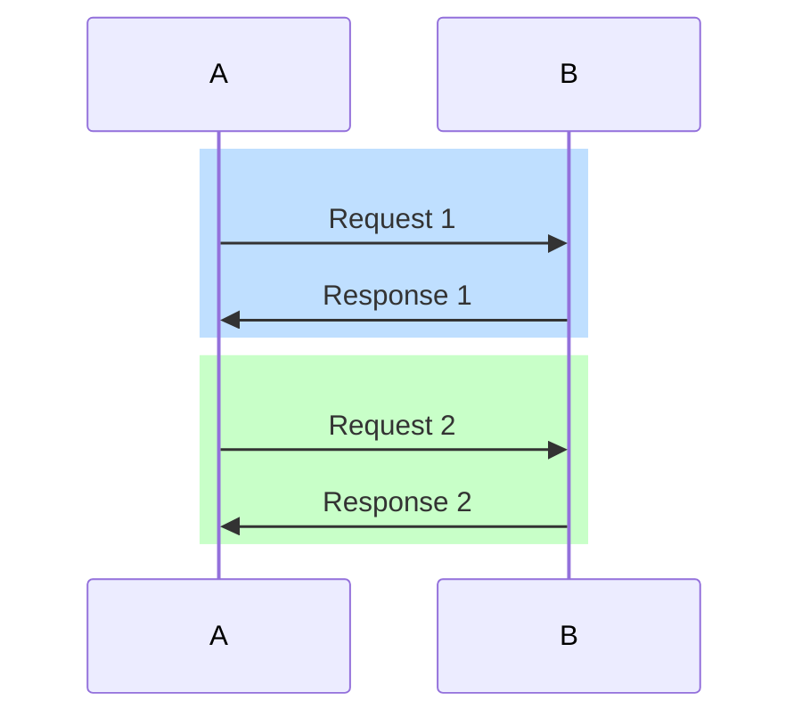

---

## 3. Class Diagram

**Keyword:** `classDiagram`

### Basic Syntax

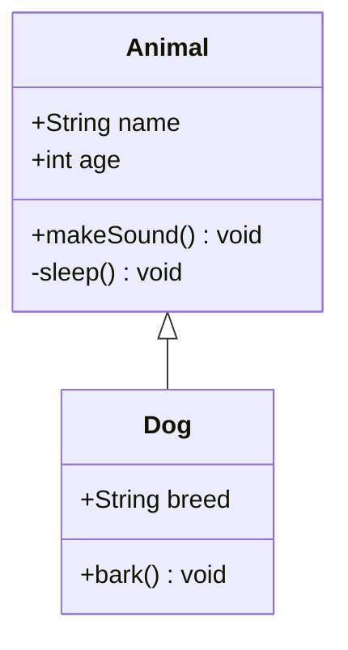

### Visibility

- `+` Public
- `-` Private
- `#` Protected
- `~` Package/Internal

### Relationship Types

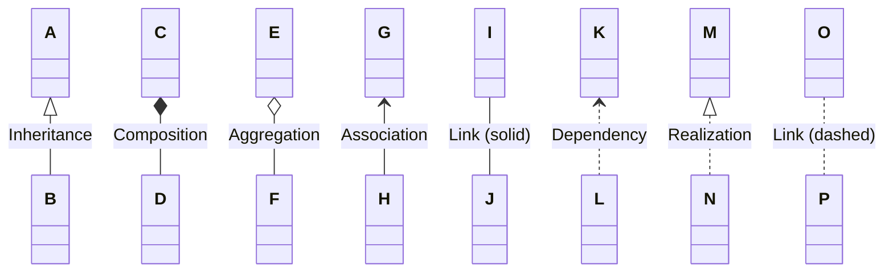

**Symbols:**
- `<|--` Inheritance (extends)
- `*--` Composition (strong ownership)
- `o--` Aggregation (weak ownership)
- `<--` Association
- `--` Solid link
- `<..` Dependency
- `<|..` Realization (implements)
- `..` Dashed link

### Cardinality

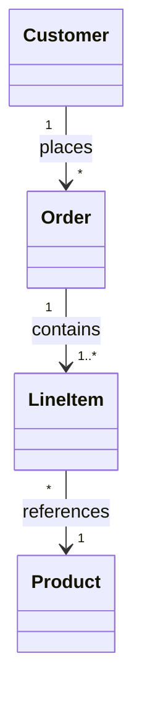

- `1` Exactly one
- `0..1` Zero or one
- `1..*` One or more
- `*` Zero or more
- `n` Specific number
- `0..n` Zero to n
- `1..n` One to n

### Annotations

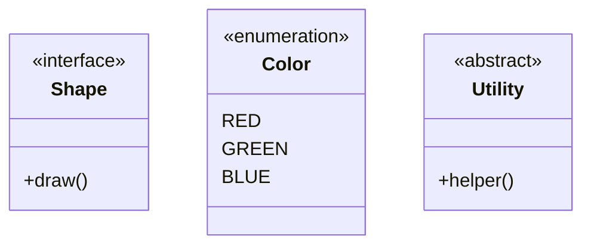

### Generic Types

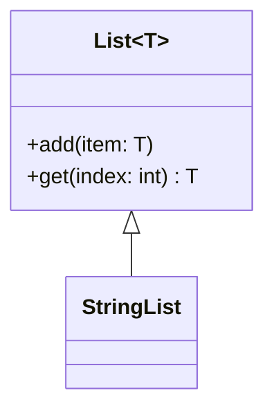

---

## 4. State Diagram

**Keyword:** `stateDiagram-v2` (use v2, not v1)

### Basic Syntax

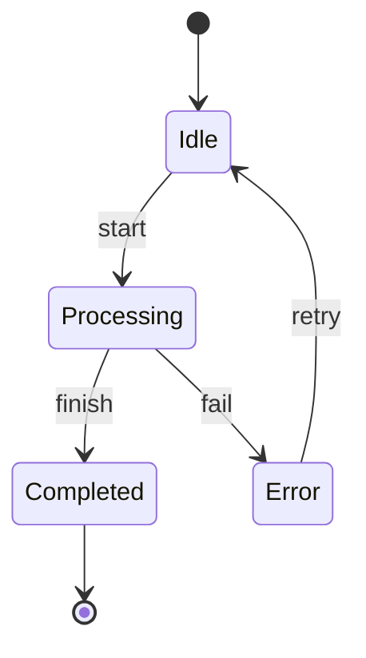

### Composite States

```mermaid
stateDiagram-v2
    [*] --> Active

    state Active {
        [*] --> Running
        Running --> Paused : pause
        Paused --> Running : resume
        Running --> [*] : stop
    }

    Active --> Inactive : deactivate
```

### Choices

```mermaid
stateDiagram-v2
    [*] --> CheckAuth
    CheckAuth --> state_choice <<choice>>
    state_choice --> Authenticated : valid token
    state_choice --> Login : no token
    state_choice --> Error : invalid token
```

### Forks and Joins

```mermaid
stateDiagram-v2
    state fork_state <<fork>>
    [*] --> fork_state
    fork_state --> State1
    fork_state --> State2
    fork_state --> State3

    State1 --> join_state
    State2 --> join_state
    State3 --> join_state

    state join_state <<join>>
    join_state --> [*]
```

### Notes

```mermaid
stateDiagram-v2
    [*] --> Processing
    Processing --> Done
    Done --> [*]

    note right of Processing
        This is a note
        Can be multi-line
    end note

    note left of Done : Short note
```

---

## 5. Entity Relationship (ER) Diagram

**Keyword:** `erDiagram`

### Basic Syntax

```mermaid
erDiagram
    CUSTOMER ||--o{ ORDER : places
    ORDER ||--|{ LINE-ITEM : contains
    PRODUCT ||--o{ LINE-ITEM : "ordered in"
```

### Relationship Types

```mermaid
erDiagram
    A ||--|| B : one-to-one
    C ||--o{ D : one-to-many
    E }o--o{ F : many-to-many
    G }|--|{ H : one-or-more-to-one-or-more
```

**Cardinality symbols:**
- `||` Exactly one
- `o|` Zero or one
- `}o` Zero or more
- `}|` One or more

**Example combinations:**
- `||--||` One to one
- `||--o{` One to zero or more
- `}o--o{` Zero or more to zero or more
- `}|--|{` One or more to one or more

### Attributes

```mermaid
erDiagram
    CUSTOMER {
        int id PK "Primary Key"
        string email UK "Unique"
        string name
        datetime created_at
    }

    ORDER {
        int id PK
        int customer_id FK
        decimal total
        string status
    }

    CUSTOMER ||--o{ ORDER : places
```

**Attribute annotations:**
- `PK` Primary Key
- `FK` Foreign Key
- `UK` Unique Key

---

## 6. Gantt Chart

**Keyword:** `gantt`

### Basic Syntax

```mermaid
gantt
    title Project Timeline
    dateFormat YYYY-MM-DD

    section Planning
    Requirements : req, 2024-01-01, 7d
    Design      : des, after req, 5d

    section Development
    Backend     : dev1, after des, 14d
    Frontend    : dev2, after des, 14d

    section Testing
    QA Testing  : test, after dev1, 7d

    section Deployment
    Deploy      : deploy, after test, 2d
```

### Task States

```mermaid
gantt
    title Task States
    dateFormat YYYY-MM-DD

    Completed task   : done, task1, 2024-01-01, 3d
    Active task      : active, task2, after task1, 3d
    Future task      : task3, after task2, 3d
    Critical task    : crit, task4, after task3, 2d
    Critical + Done  : crit, done, task5, after task4, 2d
```

**States:**
- `done` - Completed (gray)
- `active` - In progress (blue)
- `crit` - Critical path (red border)
- No state - Future task (light blue)

---

## 7. Git Graph

**Keyword:** `gitGraph`

### Basic Syntax

```mermaid
gitGraph
    commit
    commit
    branch develop
    checkout develop
    commit
    commit
    checkout main
    merge develop
    commit
```

### Full Features

```mermaid
gitGraph
    commit id: "Initial"
    commit id: "Setup" tag: "v0.1"

    branch develop
    checkout develop
    commit id: "Feature work"

    branch feature/new
    checkout feature/new
    commit id: "Implement"
    commit id: "Test"

    checkout develop
    merge feature/new

    checkout main
    merge develop tag: "v1.0"

    branch hotfix
    commit id: "Emergency fix"

    checkout main
    merge hotfix tag: "v1.0.1"
```

**Commands:**
- `commit` - Create commit
- `commit id: "message"` - Commit with message
- `branch name` - Create branch
- `checkout name` - Switch branch
- `merge name` - Merge branch
- `tag: "v1.0"` - Add tag

---

## 8. Pie Chart

**Keyword:** `pie`

### Basic Syntax

```mermaid
pie title Language Distribution
    "JavaScript" : 42
    "Python" : 30
    "Java" : 15
    "Go" : 8
    "Other" : 5
```

### With ShowData

```mermaid
pie showData title Technology Stack
    "React" : 35
    "Node.js" : 25
    "PostgreSQL" : 20
    "Redis" : 12
    "Docker" : 8
```

---

## 9. User Journey

**Keyword:** `journey`

### Basic Syntax

```mermaid
journey
    title User Shopping Journey
    section Browse
      Visit homepage: 5: User
      Search products: 3: User
      View results: 4: User
    section Purchase
      Add to cart: 5: User
      Checkout: 2: User, System
      Payment: 3: User, Payment Gateway
    section Fulfillment
      Order confirmation: 5: System
      Shipping: 4: Logistics
      Delivery: 5: User, Logistics
```

**Format:** `Task: Score: Actor1, Actor2`
- Score: 1-5 (satisfaction level)
- Actors: Who's involved in this step

---

## Common Styling Tips

### Global Theme Configuration

```mermaid
%%{init: {'theme':'dark'}}%%
graph LR
    A --> B
```

**Available themes:**
- `default` (light)
- `dark`
- `forest`
- `neutral`
- `base`

### Custom Colors

```mermaid
%%{init: {'theme':'base', 'themeVariables': { 'primaryColor':'#ff6b6b','primaryTextColor':'#fff','primaryBorderColor':'#c92a2a'}}}%%
graph TD
    A[Custom Colors]
```

### Direction

For `flowchart` and `graph`:
- `TB` or `TD` - Top to bottom
- `BT` - Bottom to top
- `LR` - Left to right
- `RL` - Right to left

---

## Escaping Special Characters

When using special characters in labels:

```mermaid
flowchart LR
    A["Text with (parentheses)"]
    B["Text with #quot;quotes#quot;"]
    C["Text with <br/> line break"]
```

Use quotes `"..."` around text with special characters.

---

## Best Practices Summary

1. **Keep it simple** - Don't overcrowd diagrams
2. **Use meaningful labels** - Avoid abbreviations unless obvious
3. **Choose appropriate direction** - LR for wide diagrams, TD for deep hierarchies
4. **Group related items** - Use subgraphs in flowcharts
5. **Add notes** - Explain non-obvious elements
6. **Use colors intentionally** - To categorize or highlight, not decorate
7. **Test syntax** - Use online Mermaid live editor to validate
8. **Version control** - Diagrams in markdown are easy to diff and review

---

## Resources

- **Official Mermaid Docs**: https://mermaid.js.org/
- **Live Editor**: https://mermaid.live/
- **VS Code Extension**: `bierner.markdown-mermaid`
- **GitHub Support**: Native rendering in `.md` files

---

## Common Errors and Fixes

### Error: "Lexical error" or "Parse error"
**Problem:** Special characters in labels (`{}`, `===`, `...`)
**Fix:** Replace with plain descriptive text
```
❌ {item, depth}     ✅ with item and depth
❌ parent === null   ✅ parent equals null
```

### Error: Subgraph parsing fails
**Problem:** Node appears in both main flow and subgraph
**Fix:** Keep subgraphs independent or remove subgraphs entirely
```
❌ WRONG:
flowchart TD
    A --> B
    subgraph Group
        B  ← Error: B already in main flow
    end

✅ CORRECT:
flowchart TD
    A --> B
    subgraph " Helper Functions "
        H1[Helper]
        H2[Helper 2]
    end
```

### Error: Cross-subgraph connections fail
**Problem:** Arrows between nodes in different subgraphs
**Fix:** Keep subgraphs independent or restructure
```
❌ Don't connect nodes across subgraphs
✅ Connect at main flow level only
```

### Error: Using `graph` instead of `flowchart`
**Problem:** `graph` has limited compatibility
**Fix:** Always use `flowchart TD` or `flowchart LR`

### Error: Duplicate node IDs in class definitions
**Problem:** `class A,A,B myclass` has duplicate A
**Fix:** Each node ID appears exactly once: `class A,B myclass`

### Error: Diagram not rendering
**Problem:** Code block not marked as mermaid
**Fix:** Use ` ```mermaid ` not ` ```

### Error: "Participant not found" (sequence diagrams)
**Problem:** Typo in participant name
**Fix:** Ensure exact spelling matches across all uses

### Layout issues
**Problem:** Nodes overlapping or poor spacing
**Fix:**
- Change direction (LR vs TD)
- Break into multiple smaller diagrams
- Remove subgraphs if causing conflicts
- Simplify complex circular flows
