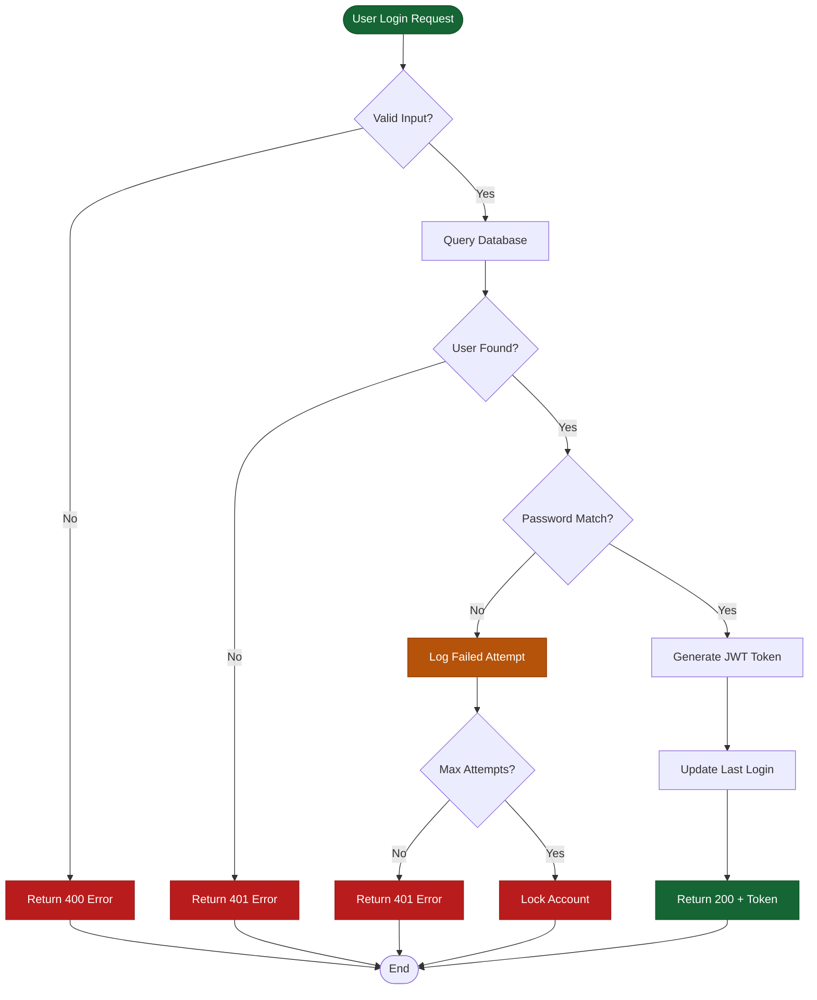
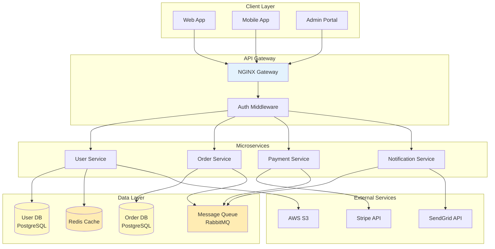
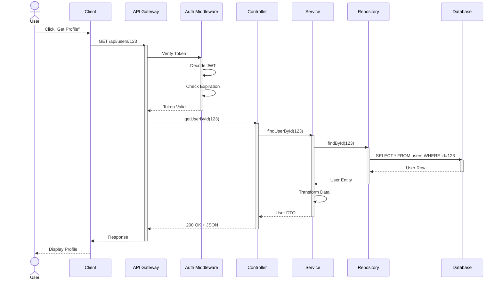
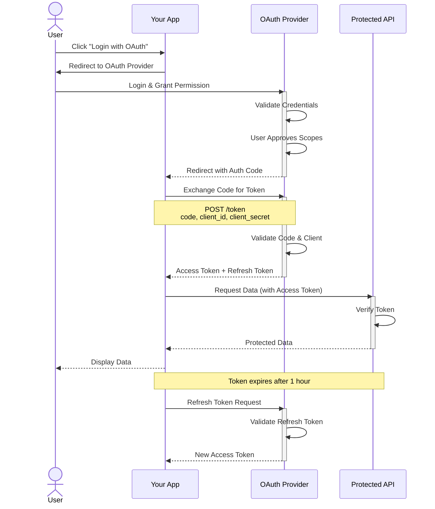
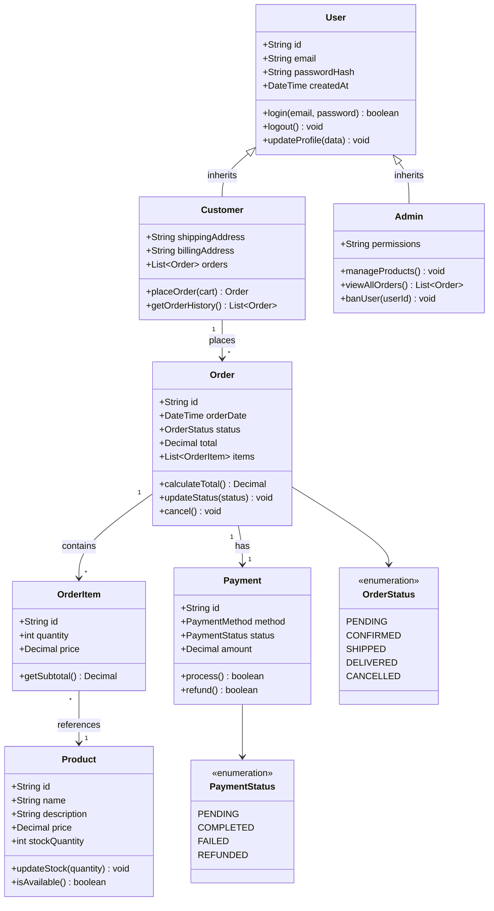
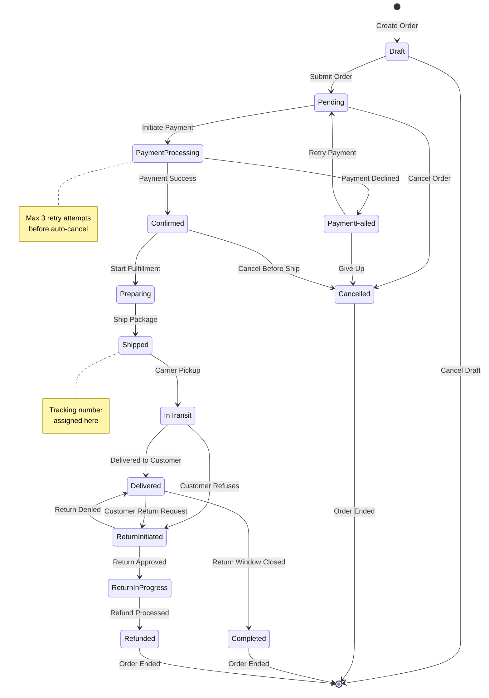
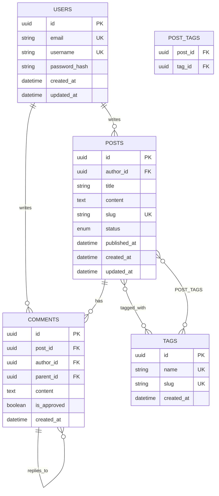
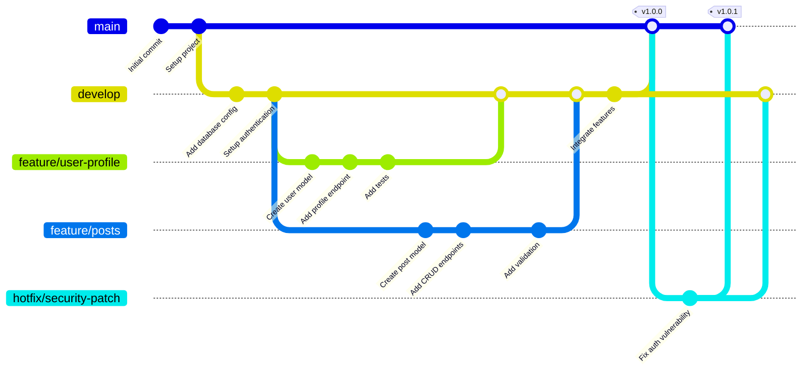
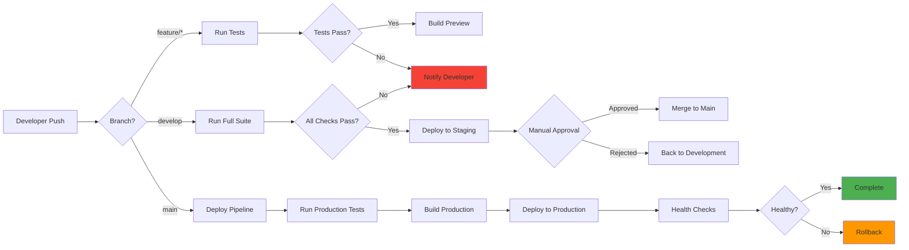
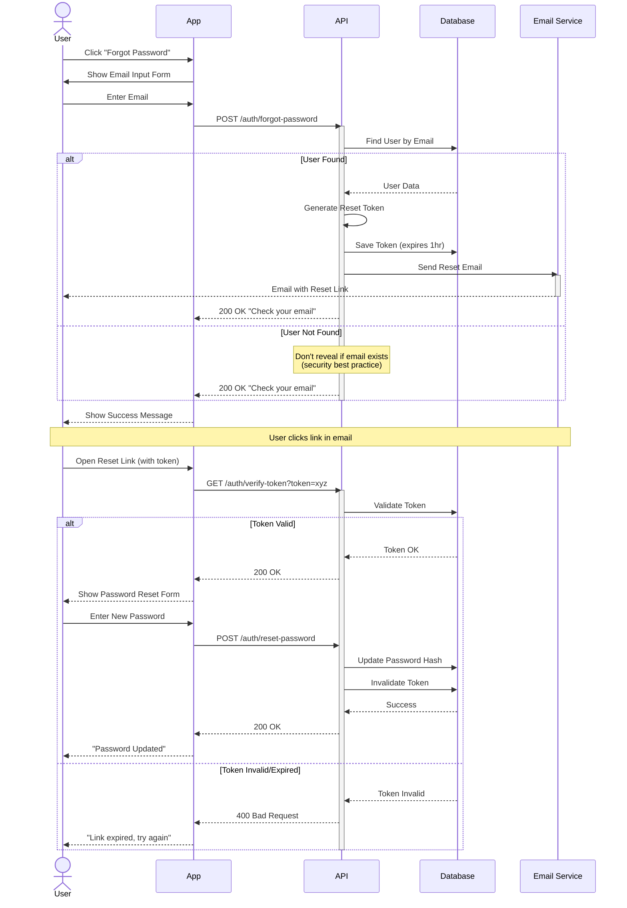

# Diagram Examples

Comprehensive examples for each diagram type showing real-world use cases.

---

## Flowchart Examples

### Example 1: Authentication Flow (Process)

**Description**
Shows the complete user authentication process with decision points and error handling.

**Diagram**

**Key Elements**
- **Green nodes**: Start and successful completion (dark green with white text for readability)
- **Red nodes**: Error states and failures (dark red with white text)
- **Orange node**: Warning state (log failed attempt)
- **Diamond nodes**: Decision points (validation, checks)
- **Rectangle nodes**: Actions and processes
- **Colors use dark mode palette**: Ensures text is readable on dark backgrounds

---

### Example 2: Microservices Architecture

**Description**
High-level architecture showing microservices, databases, and external integrations.

**Diagram**

**Key Elements**
- **Client Layer**: Multiple frontend applications
- **API Gateway**: Single entry point with authentication
- **Microservices**: Independent services with specific responsibilities
- **Data Layer**: Databases, cache, and message queue
- **External Services**: Third-party integrations

---

## Sequence Diagram Examples

### Example 3: RESTful API Request Flow

**Description**
Shows a typical API request flow through middleware, controller, service, and database layers.

**Diagram**

**Key Elements**
- **Activation boxes**: Show when each component is actively processing
- **Actors vs Participants**: User is an actor, systems are participants
- **Solid arrows**: Synchronous calls
- **Dotted arrows**: Returns/responses
- **Self-calls**: Internal processing (Transform Data)

---

### Example 4: OAuth 2.0 Authentication Flow

**Description**
Complete OAuth 2.0 authorization code flow with all parties involved.

**Diagram**

**Key Elements**
- **Notes**: Provide additional context or API details
- **Multi-step flow**: Shows complete authentication lifecycle
- **Token exchange**: Clear separation of auth code vs access token
- **Token refresh**: How to maintain session

---

## Class Diagram Examples

### Example 5: E-commerce Domain Model

**Description**
Object-oriented design for an e-commerce system showing entities and relationships.

**Diagram**

**Key Elements**
- **Inheritance**: Customer and Admin inherit from User
- **Associations**: Arrows show relationships between classes
- **Multiplicity**: "1" to "*" shows one-to-many relationships
- **Enumerations**: Define possible states for status fields
- **Methods and Properties**: Show both data (+) and behavior

---

## State Diagram Examples

### Example 6: Order Lifecycle State Machine

**Description**
Shows all possible states an order can be in and valid transitions between them.

**Diagram**

**Key Elements**
- **Initial state**: `[*]` shows where the lifecycle begins
- **Final states**: Multiple endpoints (Cancelled, Completed, Refunded)
- **Transitions**: Labeled arrows show events that trigger state changes
- **Notes**: Provide business rules or additional context
- **Loops**: PaymentFailed can loop back to Pending

---

## ER Diagram Examples

### Example 7: Blog Database Schema

**Description**
Relational database schema for a blogging platform with users, posts, comments, and tags.

**Diagram**

**Key Elements**
- **Cardinality**: `||--o{` means one-to-many, `}o--o{` means many-to-many
- **Primary Keys (PK)**: Unique identifier for each entity
- **Foreign Keys (FK)**: References to other tables
- **Unique Keys (UK)**: Unique constraints (email, username, slug)
- **Self-referencing**: COMMENTS can reply to other COMMENTS
- **Join Table**: POST_TAGS handles many-to-many relationship

---

## Git Graph Examples

### Example 8: Git Branching Strategy

**Description**
Git workflow showing feature branches, releases, and hotfixes.

**Diagram**

**Key Elements**
- **Main branch**: Production-ready code
- **Develop branch**: Integration branch for features
- **Feature branches**: Isolated development
- **Hotfix branches**: Emergency fixes applied to main
- **Tags**: Version releases
- **Merges**: Integration points

---

## Additional Examples

### Example 9: CI/CD Pipeline

**Description**
Continuous integration and deployment pipeline workflow.

**Diagram**

**Key Elements**
- **Branch-specific flows**: Different pipelines for different branches
- **Quality gates**: Tests and approvals before progression
- **Rollback capability**: Safety mechanism for failed deployments
- **Color coding**: Green for success, red for failure, orange for warning

---

### Example 10: User Journey (Complex Sequence)

**Description**
Complete user journey for password reset with email verification.

**Diagram**

**Key Elements**
- **Alt blocks**: Handle multiple outcomes (user found vs not found)
- **Security notes**: Highlight security best practices
- **Multi-stage flow**: Complete journey from start to finish
- **Email interaction**: Shows external service integration
- **Time-sensitive tokens**: Expiration handling

---

## Usage Tips

- **Choose the right diagram type** based on what you're trying to show
- **Start simple** and add details as needed
- **Use colors and styling** to highlight important elements
- **Add notes** to explain non-obvious aspects
- **Keep it focused** - break complex systems into multiple diagrams
- **Test rendering** in VS Code with Mermaid extension before finalizing
